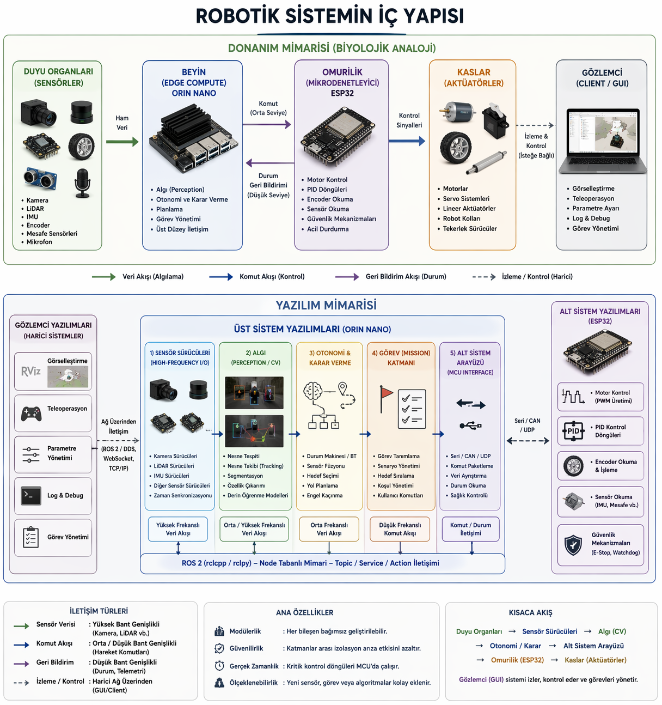

# Robotik Sistemlerin İç Yapısı

Robotik sistemler, dışarıdan bakıldığında tek bir makine gibi görünse de, gerçekte birbirinden ayrılmış ama uyum içinde çalışan çok katmanlı bir yapıya sahiptir. Bu yapı hem **donanım** hem de **yazılım** tarafında bilinçli bir ayrım ve dağıtıklık üzerine kuruludur. Böyle bir mimari, sistemin daha modüler, güvenilir ve geliştirilebilir olmasını sağlar.

Aşağıda, modern bir robotik sistemin iç yapısını bütüncül bir çerçevede ele alıyoruz.

<div align="center">
    
</div>

---

# 🧩 Donanım Mimarisi: Biyolojik Bir Yaklaşım

Robotik sistemleri anlamanın en sezgisel yollarından biri, onları biyolojik bir organizmaya benzetmektir. Bu benzetme, sistemdeki görev dağılımını oldukça net hale getirir.

## 🧠 Beyin — Edge Computation (Orin Nano)

Robotun beyni, yüksek işlem gücüne sahip bir edge bilgisayardır. Bu katman:

* Görüntü işleme
* Nesne tespiti ve takibi
* Haritalama ve lokalizasyon (SLAM)
* Karar verme ve planlama

gibi karmaşık işlemleri gerçekleştirir.

Beyin, robotun çevresini anlamlandırır ve ne yapılması gerektiğine karar verir.

---

## 🧬 Omurilik — Mikrodenetleyici (ESP32)

Omurilik, düşük seviye kontrolün merkezidir. Bu katman:

* Motor sürme (PWM)
* Encoder okuma
* PID kontrol döngüleri
* Güvenlik mekanizmaları (watchdog, emergency stop)

gibi görevleri üstlenir.

Beyinden gelen komutları hızlı, deterministik ve güvenilir şekilde uygular.

---

## 👁️ Duyu Organları — Sensörler

Sensörler robotun çevreyi ve kendi durumunu algılamasını sağlar:

* Kamera
* LiDAR
* IMU
* Encoder
* Mesafe sensörleri

Bu bileşenler ham veriyi üretir ve beyin bu veriyi anlamlandırır.

---

## 💪 Kaslar — Aktüatörler

Aktüatörler robotun fiziksel dünyaya etki etmesini sağlar:

* Motorlar
* Servo sistemler
* Lineer aktüatörler
* Robot kolları

Kaslar, omurilikten gelen komutları harekete dönüştürür.

---

## 🖥️ Gözlemci — Client / GUI

Sistemin dışında konumlanan gözlemci, kullanıcı ile robot arasındaki arayüzdür.

* Görselleştirme
* Teleoperasyon
* Debug ve log izleme
* Parametre ayarı

Bu katman robotun bir parçası değildir; sistemi dışarıdan izler ve gerektiğinde müdahale eder.

---

# 🧠 Yazılım Mimarisi: Katmanlı Yapı

Donanımdaki bu ayrım, yazılım tarafında da karşılığını bulur. Yazılım üç ana katmana ayrılır:

---

## 🖥️ Gözlemci Yazılımları (Harici Sistemler)

* Robot dışında çalışır
* Görselleştirme ve kontrol sağlar
* Kritik değildir (çökerse robot çalışmaya devam eder)

Örneğin: dashboard’lar, teleop arayüzleri, RViz

---

## 🧠 Üst Sistem Yazılımları (Orin Nano)

Robotun zekâ katmanıdır. Genellikle ROS 2 üzerinde çalışır.

### Bu katman kendi içinde ayrılır:

---

### 🔌 Sensör Sürücüleri

* Yüksek frekanslı veri üretir
* Donanıma bağımlıdır
* Veriyi üst katmanlara hazırlar

👉 Veriyi üretir, yorumlamaz

---

### 🔗 Alt Sistem Arayüzü

* Mikrodenetleyici ile iletişim kurar
* Komut ve geri bildirim taşır

👉 Beyin ile omurilik arasındaki köprü

---

### 👁️ Algı (Perception / CV)

* Görüntü işleme
* Nesne tespiti ve tracking
* Sensör verisini anlamlandırma

👉 Gördüğünü anlamlandırır

---

### 🧠 Otonomi ve Karar Verme

* State machine / behavior
* Path planning
* Hedef seçimi

👉 Ne yapılacağına karar verir

---

### 🎯 Görev (Mission) Katmanı

* Yüksek seviyeli hedefler
* Senaryo yönetimi

👉 Neden yapıldığını belirler

---

## 🧬 Alt Sistem Yazılımları (ESP32)

* Gömülü sistemde çalışır
* Gerçek zamanlıdır
* Donanımı doğrudan kontrol eder

### Görevleri

* Motor kontrol
* PID döngüleri
* Sensör okuma
* Güvenlik mekanizmaları

👉 Karar vermez, uygular

---

# 🔄 Sistem Akışı

Tüm bu yapı birlikte şu akışı oluşturur:

```text
Duyu Organları (Sensörler)
        ↓
Sensör Sürücüleri
        ↓
Algı (Perception)
        ↓
Otonomi / Karar
        ↓
Alt Sistem Arayüzü
        ↓
Omurilik (ESP32)
        ↓
Kaslar (Aktüatörler)
```

Ve üstten gelen görev akışı:

```text
Görev Katmanı
      ↓
Otonomi
      ↓
Kontrol Komutları
      ↓
Alt Sistem
```

---

# ⚖️ Bu Mimarinin Kazandırdıkları

### ✅ Modülerlik

Her bileşen bağımsız geliştirilebilir ve değiştirilebilir.

### ✅ Güvenilirlik

* GUI çöker → robot çalışır
* Üst sistem çöker → alt sistem güvenli duruma geçer

### ✅ Performans

* Gerçek zamanlı işler MCU’da kalır
* Ağ gecikmeleri kritik kontrolü etkilemez

### ✅ Geliştirilebilirlik

* CV, embedded ve robotics ekipleri paralel çalışabilir

---

# 🧠 Sonuç

Modern robotik sistemler, tek parça bir yazılım ya da donanım yığını değil; aksine iyi tanımlanmış katmanlara ayrılmış dağıtık sistemlerdir.

Robot:

* Duyu organlarıyla algılar
* Beyniyle yorumlar
* Omuriliğiyle uygular
* Kaslarıyla hareket eder

ve tüm bu süreç, dışarıdan bir gözlemci tarafından izlenir.

Bu yaklaşım, robotik sistemleri daha anlaşılır, daha güçlü ve gerçek dünya problemlerine daha uygun hale getirir.
