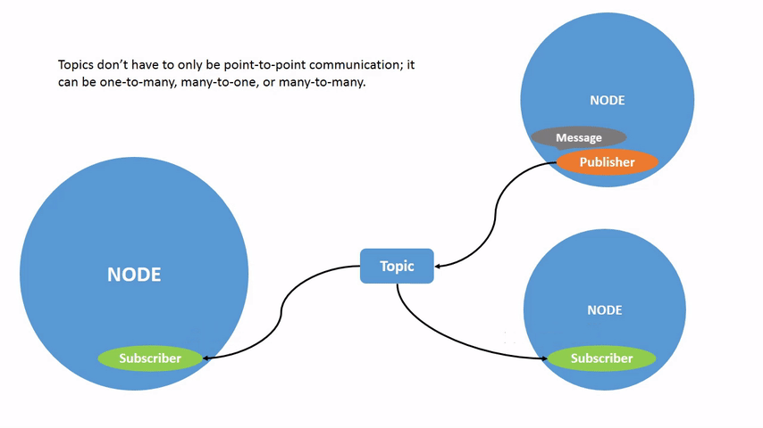

# ROS2 ile Robotik Sistemlere Giriş

## İçindekiler

1. [Robotik Sistemler Nedir?](#1-robotik-sistemler-nedir)
   - 1.1 [Yazılımın Robotikteki Belirleyici Rolü](#11-yazılımın-robotikteki-belirleyici-rolü)
2. [ROS'un Robotik Sistemlerdeki Pozisyonu](#2-rosun-robotik-sistemlerdeki-pozisyonu)
   - 2.1 [Robotik Yazılımda Ortak Sorunlar](#21-robotik-yazılımda-ortak-sorunlar)
   - 2.2 [Soyutlama Katmanının Önemi](#22-soyutlama-katmanının-önemi)
   - 2.3 [ROS'un Ekosistem İçindeki Yeri](#23-rosun-ekosistem-içindeki-yeri)
   - 2.4 [Neden Standart Bir Middleware?](#24-neden-standart-bir-middleware)
3. [ROS Nedir?](#3-ros-nedir)
   - 3.1 [Meta-İşletim Sistemi Kavramı](#31-meta-işletim-sistemi-kavramı)
   - 3.2 [Temel Kavramlara Giriş](#32-temel-kavramlara-giriş)
   - 3.3 [ROS'un Sağladığı Araç Ekosistemi](#33-rosun-sağladığı-araç-ekosistemi)
4. [ROS'tan ROS2'ye](#4-rostan-ros2ye)
   - 4.1 [ROS1'in Sınırlılıkları](#41-ros1in-sınırlılıkları)
   - 4.2 [ROS2'nin Mimarisi: DDS Üzerine Kurulan Dağıtık Sistem](#42-ros2nin-mimarisi-dds-üzerine-kurulan-dağıtık-sistem)
   - 4.3 [DDS Nedir?](#43-dds-nedir)
   - 4.4 [ROS2'nin Öne Çıkan Özellikleri](#44-ros2nin-öne-çıkan-özellikleri)
   - 4.5 [ROS1 ile ROS2 Karşılaştırması](#45-ros1-ile-ros2-karşılaştırması)
5. [Haberleşme](#5-haberleşme)
   - 5.1 [Giriş](#51-giriş)
   - 5.2 [Teori](#52-teori)
     - 5.2.1 [Topic](#521-topic)
     - 5.2.2 [Service](#522-service)
     - 5.2.3 [Action Service](#523-action-service)
     - 5.2.4 [Özel Mesaj Arayüzleri](#524-özel-mesaj-arayüzleri)
   - 5.3 [Kullanım](#53-kullanım)
     - 5.3.1 [API (Python)](#531-api-python)
     - 5.3.2 [CLI](#532-cli)
     - 5.3.3 [Genel Tavsiye](#533-genel-tavsiye)
6. [Paketler ve Çalışma Alanları](#6-paketler-ve-çalışma-alanları)
   - 6.1 [Giriş](#61-giriş)
   - 6.2 [Teori](#62-teori)
     - 6.2.1 [Çalışma Alanı (Workspace) Kavramı](#621-çalışma-alanı-workspace-kavramı)
     - 6.2.2 [ROS2 Paketi Nedir?](#622-ros2-paketi-nedir)
     - 6.2.3 [Derleme Sistemi — colcon](#623-derleme-sistemi--colcon)
   - 6.3 [Kullanım](#63-kullanım)
     - 6.3.1 [API (Python)](#631-api-python)
     - 6.3.2 [CLI](#632-cli)
     - 6.3.3 [Genel Tavsiye](#633-genel-tavsiye)
7. [Parametreler](#7-parametreler)
   - 7.1 [Giriş](#71-giriş)
   - 7.2 [Teori](#72-teori)
     - 7.2.1 [Parametre Sunucusu Kavramı](#721-parametre-sunucusu-kavramı)
     - 7.2.2 [Parametre Yaşam Döngüsü](#722-parametre-yaşam-döngüsü)
     - 7.2.3 [YAML ile Yapılandırma](#723-yaml-ile-yapılandırma)
   - 7.3 [Kullanım](#73-kullanım)
     - 7.3.1 [API — Python](#731-api--python)
     - 7.3.2 [CLI](#732-cli)
     - 7.3.3 [Genel Tavsiye](#733-genel-tavsiye)
8. [Gözlem Araçları](#8-gözlem-araçları)
   - 8.1 [Giriş](#81-giriş)
   - 8.2 [Teori](#82-teori)
     - 8.2.1 [Sistem Gözleminin Önemi](#821-sistem-gözleminin-önemi)
     - 8.2.2 [rqt — Grafik Araç Ekosistemi](#822-rqt--grafik-araç-ekosistemi)
     - 8.2.3 [rosbag2 — Veri Kaydı ve Oynatma](#823-rosbag2--veri-kaydı-ve-oynatma)
     - 8.2.4 [RViz — 3D Görselleştirme](#824-rviz--3d-görselleştirme)
   - 8.3 [Kullanım](#83-kullanım)
     - 8.3.1 [API — rosbag2_py](#831-api--rosbag2_py)
     - 8.3.2 [CLI](#832-cli)
     - 8.3.3 [Genel Tavsiye](#833-genel-tavsiye)
9. [Launch Sistemi](#9-launch-sistemi)
   - 9.1 [Giriş](#91-giriş)
   - 9.2 [Teori](#92-teori)
     - 9.2.1 [Launch Sistemi Nedir?](#921-launch-sistemi-nedir)
     - 9.2.2 [Launch Dosyasının Anatomisi](#922-launch-dosyasının-anatomisi)
     - 9.2.3 [Namespace ve Remapping](#923-namespace-ve-remapping)
   - 9.3 [Kullanım](#93-kullanım)
     - 9.3.1 [API (Python)](#931-api-python)
     - 9.3.2 [CLI](#932-cli)
     - 9.3.3 [Genel Tavsiye](#933-genel-tavsiye)
10. [QoS](#10-qos)
11. [Modelleme — URDF](#11-modelleme--urdf)
12. [Koordinasyon — tf2](#12-koordinasyon--tf2)

---

## 1. Robotik Sistemler Nedir?

Bir robotu en yalın biçimiyle tanımlamak gerekirse: fiziksel dünyayı algılayan (sensing), bu algıyı işleyen (computation) ve çevresini etkileyen (actuation) otonom ya da yarı-otonom bir sistemdir. Bu üç katman, modern robotik sistemlerin temel iskeletini oluşturur.

**Algılama (Sensing)** katmanında kameralar, lidar sensörleri, IMU'lar (atalet ölçüm birimleri) ve enkoder gibi donanımlar robotun çevresinden veri toplar. Bu veriler ham sayısal sinyallerdir; anlam kazanmaları için işlenmesi gerekir.

**İşleme (Computation)** katmanı toplanan ham veriyi yorumlayan, karar veren ve bir sonraki hareketi planlayan yazılım katmanıdır. Nesne tanıma algoritmalarından yol planlama algoritmalarına, kontrolcülerden durum makinelerine kadar pek çok yazılım bileşeni bu katmanda çalışır.

**Eylem (Actuation)** katmanı ise işleme sonucunda üretilen komutları fiziksel harekete dönüştüren motorlar, servolar, pnömatik sistemler ve benzeri donanımları kapsar.

> **Gerçek hayat örneği:** İnsan sinir sistemini düşünün. Gözleriniz ve kulakları (algılama), beyin bu sinyalleri işler ve yorumlar (işleme), kaslarınız hareketi gerçekleştirir (eylem). Bir robotun mimarisi bu biyolojik döngüyü taklit eder — fark yalnızca bileşenlerin silikon ve metal olmasıdır.

### 1.1 Yazılımın Robotikteki Belirleyici Rolü

Geçmişte robotik sistemlerin pahalı olmasının temel nedeni özel donanımlardı. Günümüzde servo motorların, sensörlerin ve işlemcilerin maliyeti dramatik biçimde düşmüştür. Artık rekabet, donanım üretiminden yazılım kalitesine kaymıştır.

Aynı donanım platformu üzerinde çalışan iki robot birbirinden tamamen farklı davranabilir; çünkü farkı yaratan yazılımdır. Bu gerçeklik, robotik yazılım geliştirme süreçlerini daha fazla önemsemeyi zorunlu kılar: tekrar kullanılabilirlik, modülerlik, test edilebilirlik ve güvenilirlik artık birincil tasarım kriterleri haline gelmiştir.

---

## 2. ROS'un Robotik Sistemlerdeki Pozisyonu

### 2.1 Robotik Yazılımda Ortak Sorunlar

Robotik sistem geliştiren her ekip, başlangıçta benzer sorunlarla karşılaşır: Sensör verisi nasıl okunacak? Bileşenler birbirleriyle nasıl haberleşecek? Motor sürücüsü ile görüntü işleme modülü nasıl senkronize edilecek? Simülasyon ortamında test nasıl yapılacak?

ROS'tan (Robot Operating System) önce her ekip bu soruları sıfırdan çözüyordu. Farklı laboratuvarlar, farklı şirketler, farklı ülkelerdeki araştırmacılar birbirinden habersiz biçimde aynı tekerleği yeniden icat ediyordu. Geliştirilen kütüphaneler kapalı kaynaklıydı, ekipler arasında paylaşılamıyordu ve platform değiştiğinde büyük bölümü kullanılamaz hale geliyordu.

### 2.2 Soyutlama Katmanının Önemi

ROS'un getirdiği en kritik katkı bir **soyutlama katmanı** (abstraction layer) oluşturmasıdır. Soyutlama katmanı, alt taraftaki donanım farklılıklarını ve iletişim protokollerinin karmaşıklığını gizleyerek geliştiricinin yalnızca üst katman mantığına odaklanmasını sağlar.

Bir lidar sensörüyle çalışmak istediğinizde, sensörün USB mi yoksa Ethernet mi bağlı olduğunu, hangi veri formatını kullandığını ya da hangi üreticinin sürücüsünü gerektirdiğini bilmeniz gerekmez. ROS bu ayrıntıları soyutlar; siz yalnızca sensörden gelen veri akışını tüketen kodunuzu yazarsınız.

> **Gerçek hayat örneği:** Bir web geliştiricisi HTTP protokolünün TCP/IP üzerinde nasıl çalıştığını, TCP paketlerinin ağda nasıl yönlendirildiğini bilmeden uygulama yazabilir. Katmanlı mimari, her katmanın kendi sorumluluğuna odaklanmasını sağlar. ROS, robotik dünyada bu rolü üstlenir.

### 2.3 ROS'un Ekosistem İçindeki Yeri

ROS'u bir "işletim sistemi" olarak adlandırmak kısmen yanıltıcıdır. ROS, Linux ya da Windows gibi donanım kaynağını doğrudan yöneten bir işletim sistemi değildir. Aksine, mevcut bir işletim sistemi üzerinde (genellikle Linux) çalışan, robotik uygulamalar için altyapı sunan bir **middleware** (ara katman yazılımı) ekosistemidir.

Katmanlı yapı şu şekilde düşünülebilir:

| Katman | Açıklama |
|---|---|
| Uygulama (Application) | Robotun görevine özgü mantık (navigasyon, kavrama, diyalog) |
| **ROS** | İletişim altyapısı, araçlar, kütüphaneler |
| İşletim Sistemi (OS) | Linux, Windows, macOS |
| Donanım (Hardware) | İşlemci, bellek, çevresel birimler |

ROS bu mimaride "uygulama" ile "işletim sistemi" arasında konumlanır. Uygulamanın işletim sistemine olan bağımlılığını azaltır ve robotik bileşenlerin birbirleriyle standart bir dil konuşmasını sağlar.

### 2.4 Neden Standart Bir Middleware?

Standartlaşmanın somut kazanımları vardır:

- **Yeniden kullanım:** Topluluk tarafından geliştirilmiş binlerce hazır paket, kendi sisteminize doğrudan entegre edilebilir.
- **Topluluk:** Dünya genelinde on binlerce araştırmacı ve mühendis aynı altyapıyı kullanır; hatalar daha hızlı bulunur, çözümler paylaşılır.
- **Hız:** Sıfırdan yazmak yerine mevcut bileşenlerden derleme yapmak, prototipten ürüne geçişi önemli ölçüde hızlandırır.

---

## 3. ROS Nedir?

### 3.1 Meta-İşletim Sistemi Kavramı

ROS, Robot Operating System kelimelerinin baş harflerinden oluşur ve robot işletim sistemi manasına gelir. Ancak ROS gerçek bir işletim sistemi değildir.

Peki o zaman neden ismini ROS koymuşlar?

Çünkü ROS robotik uygulamalar için geliştirilmiş bir **meta-işletim sistemidir**.

- **İşletim sistemi:** Donanım kaynaklarını yöneten ve yazılımların bu kaynakları uyum içinde kullanmasını sağlayan sistemdir.
- **Meta-işletim sistemi:** Gerçek bir işletim sistemi olmamasına rağmen bir işletim sisteminin yaptığı işlerin çoğunu yapabilen (ya da taklit eden) yazılımlardır.

Bir işletim sistemi çekirdek (kernel) düzeyinde çalışırken ROS kullanıcı alanında (user space) çalışır. Bu ayrım, ROS'u son derece esnek kılar: farklı Linux dağıtımları üzerinde, farklı mimarilerde çalışabilir.

#### ROS'un Temel (Çekirdek) Özellikleri

ROS, robotik yazılım bileşenleri arasındaki haberleşmeyi, kaynak yönetimini ve modüler yapıyı organize eder. Klasik işletim sistemlerinin çekirdek görevlerini üstlenir; ancak bu görevleri robotik sistemlerin gereksinimlerine uygun şekilde yeniden yorumlar.

| | Haberleşme |
|---|---|
| **OS** | Farklı süreçler (process) arasında veri alışverişi, IPC (Inter-Process Communication), soketler veya mesaj kuyrukları aracılığıyla sağlanır. |
| **ROS** | Farklı düğümler (nodes) arasındaki veri alışverişi, publish/subscribe ve service mekanizmalarıyla yapılır. Böylece süreçler arasında gerçek zamanlı, modüler ve dağıtık iletişim sağlanır. |

| | Paket Yönetimi |
|---|---|
| **OS** | Yazılım bileşenleri, `apt`, `yum` gibi paket yöneticileri ile kurulur ve yönetilir. |
| **ROS** | Yazılım modülleri ROS paketleri olarak düzenlenir ve `rosdep`, `rospack` gibi araçlarla bağımlılıklar yönetilir. Her işlevsel bileşen, bağımsız ama entegre bir yapıda tutulur. |

| | Ortam Değişkenleri |
|---|---|
| **OS** | Ortam değişkenleri, tüm süreçlerin erişebileceği genel ayarları tanımlar (örneğin `PATH`, `HOME`). |
| **ROS** | Parametre sunucusu benzer şekilde sistem genelinde erişilebilen ayarları saklar. Tüm düğümler ortak konfigürasyon değerlerini merkezi bir yerden alabilir. |

| | Başlatma Araçları |
|---|---|
| **OS** | Programlar genellikle bash scriptleri, `systemd` servisleri veya komut dosyalarıyla başlatılır. |
| **ROS** | `ros2 launch` aracı, birden fazla düğümün aynı anda konfigürasyonlu biçimde başlatılmasını sağlar. Sistem bir bütün olarak kolayca ayağa kaldırılabilir. |

| | Donanım Soyutlama |
|---|---|
| **OS** | Donanımlara erişim sürücüler (drivers) ve API'ler aracılığıyla soyutlanır. |
| **ROS** | Donanım bağımlılıkları ROS control, hardware interface veya özel sürücüler aracılığıyla soyutlanır. Robotlar, farklı donanımlar üzerinde aynı yazılımla çalışabilir hale gelir. |

#### ROS'un Araç Özellikleri

ROS, yalnızca bir haberleşme altyapısı değil; aynı zamanda robotların koordinasyon, gözlemleme ve modelleme süreçlerini destekleyen kapsamlı bir geliştirme ekosistemidir.

##### Konumlama

ROS'un `tf2` sistemi, farklı bileşenlerin (kamera, sensör vb.) kendi koordinat sistemleri arasındaki uzaysal dönüşümleri yönetir. Böylece bileşenler, birbirlerinin konum ve yönelim bilgisine zaman senkronizasyonu içinde erişebilir. Bu yapı, özellikle hareket planlama ve sensör füzyonu için kritiktir.

##### İzleme

ROS2; `rqt_graph`, `rosbag2` ve `RViz2` araçlarıyla sistem yapısını ve verilerini inceleme olanağı sunar.

- **rqt_graph** — düğümler arasındaki veri akışını görselleştirir
- **rosbag2** — sensör verilerini kaydeder ve oynatır
- **RViz2** — robotu ve çevresini 3D olarak gösterir

Bu araçların ayrıntılı kullanımı Bölüm 8'de ele alınmaktadır.

##### Modelleme

**URDF** (Unified Robot Description Format), robotun fiziksel yapısını XML tabanlı olarak tanımlar. Gövde, eklemler, kütle ve görsel bileşenler bu dosyada yer alır. URDF, simülasyon, görselleştirme ve hareket planlama gibi işlemlerin temelini oluşturur.

---

## 4. ROS'tan ROS2'ye

### 4.1 ROS1'in Sınırlılıkları

ROS 2007 yılında Stanford Yapay Zeka Laboratuvarı'nda doğdu ve araştırma ortamlarının ihtiyaçlarına göre tasarlandı. Yıllar içinde endüstriyel ve kritik uygulamalara taşınmaya çalışıldığında bazı temel mimari kısıtlamalar belirginleşti:

**Tek merkezi yönetici (ROS Master):** ROS1'de tüm node'ların birbirini bulabilmesi için `roscore` adı verilen merkezi bir sürecin çalışması gerekir. Bu süreç durduğunda tüm sistem çöker. Yedekleme ve dağıtık dağıtım mümkün değildir.

**Gerçek zamanlı (real-time) destek eksikliği:** ROS1'in iletişim altyapısı determinizm garantisi vermez. Endüstriyel kontrol sistemleri, cerrahi robotlar veya otonom araçlar gibi uygulamalarda mesajların belirli bir gecikme sınırı içinde iletilmesi kritik önem taşır. ROS1 bu garantiyi sağlayamaz.

**Güvenlik altyapısının yokluğu:** ROS1'de node'lar arasındaki iletişim şifrelenmez ve kimlik doğrulaması yapılmaz. Araştırma laboratuvarları için bu yeterli olabilir, ancak kamuya açık ortamlarda çalışan sistemler için kabul edilemez bir güvenlik açığıdır.

**Platform kısıtlaması:** ROS1 yalnızca Linux üzerinde resmi olarak desteklenir. Windows ve macOS desteği sınırlı ve topluluk tabanlıdır.

### 4.2 ROS2'nin Mimarisi: DDS Üzerine Kurulan Dağıtık Sistem

ROS2, ROS1'in sınırlılıklarını aşmak için sıfırdan yeniden tasarlanmıştır. Temel mimari fark, ROS2'nin **DDS** (Data Distribution Service — Veri Dağıtım Servisi) adlı endüstriyel standartta bir middleware üzerine inşa edilmiş olmasıdır.

### 4.3 DDS Nedir?

DDS, nesne yönetim grubu (OMG) tarafından tanımlanmış, gerçek zamanlı dağıtık sistemler için tasarlanmış bir iletişim standardıdır. Savunma sanayii, tıbbi cihazlar, finans sistemleri ve havacılık gibi güvenilirliğin kritik olduğu alanlarda yıllardır kullanılmaktadır.

DDS'in en önemli özelliği **merkezi aracısız** (broker-less) çalışmasıdır. Node'lar birbirini otomatik olarak keşfeder (discovery) ve doğrudan haberleşir (peer-to-peer). Merkezi bir koordinatör sürecine ihtiyaç yoktur.

> **Gerçek hayat örneği:** ROS1'i merkezi bir posta ofisi gibi düşünün. Tüm mektuplar önce posta ofisine gelir, oradan yönlendirilir. Posta ofisi kapanırsa mektuplar iletilemez. ROS2 ise dağıtık bir kurye ağı gibidir: her kurye göndericiyi ve alıcıyı doğrudan bulur, merkezi bir ofise ihtiyaç duymaz. Bir kurye devre dışı kalsa bile ağın geri kalanı çalışmaya devam eder.

### 4.4 ROS2'nin Öne Çıkan Özellikleri

**Çoklu platform desteği:** ROS2, Linux, Windows ve macOS üzerinde resmi olarak desteklenir. Aynı paket kodu farklı platformlarda derlenip çalıştırılabilir.

**QoS (Quality of Service — Hizmet Kalitesi) politikaları:** ROS2'de her topic için iletişim kalite parametreleri yapılandırılabilir. Güvenilirlik (reliability), geçmiş mesaj sayısı (history), dayanıklılık (durability) gibi politikalar uygulamaya göre ince ayar yapılmasına olanak tanır.

**Güvenlik:** ROS2, DDS-Security standardı üzerinden şifreleme, kimlik doğrulama ve erişim kontrolü sağlar. `SROS2` araçları ile güvenlik sertifikaları yönetilebilir.

**Lifecycle Nodes (Yaşam Döngüsü Node'ları):** ROS2'de node'ların başlatma, yapılandırma, aktif, pasif ve kapatma gibi yaşam döngüsü durumları standartlaştırılmıştır. Bu özellik, sistemin kontrollü biçimde başlatılıp kapatılmasını sağlar.

**Çoklu robot ve gömülü sistem desteği:** DDS'in dağıtık yapısı, birden fazla robotun aynı ağda koordineli çalışmasını doğal olarak destekler. Ayrıca mikrodenetleyici düzeyindeki cihazlarda çalışabilen `micro-ROS` projesi ile gömülü sistemler ROS2 ekosistemiyle bütünleştirilebilir.

### 4.5 ROS1 ile ROS2 Karşılaştırması

| Özellik | ROS1 | ROS2 |
|---|---|---|
| İletişim altyapısı | Özel (TCPROS/UDPROS) | DDS standardı |
| Merkezi koordinatör | Zorunlu (roscore) | Yok (peer-to-peer keşif) |
| Gerçek zamanlı destek | Yok | Var (DDS QoS ile) |
| Güvenlik | Yok | Var (DDS-Security) |
| Platform desteği | Yalnızca Linux | Linux, Windows, macOS |
| Çoklu robot | Sınırlı | Doğal destek |
| Node yaşam döngüsü | Standart değil | Lifecycle Node standardı |
| Python sürümü | Python 2 | Python 3 |
| Aktif geliştirme | Hayır (EOL 2025) | Evet |

> **Gerçek hayat örneği:** ROS1'den ROS2'ye geçişi, monolitik bir sunucu mimarisinden mikroservis mimarisine geçiş olarak düşünebilirsiniz. Monolitik mimaride merkezi sunucu çökünce her şey durur; mikroservis mimarisinde bileşenler birbirinden bağımsız çalışmaya devam edebilir. ROS2'nin dağıtık DDS mimarisi, benzer bir dayanıklılık ve esneklik kazanımı sağlar.

---

## 5. Haberleşme

### 5.1 Giriş

Bu bölüm, önceki bölümlerde tanıdığınız düğüm ve çizge kavramlarının bir adım ötesine taşır: ROS2 düğümlerinin birbirleriyle nasıl konuştuğunu ele alır. Yani haberleşme altyapısını hem teorik hem de uygulama düzeyinde inceliyoruz.

Bu bölümü okuduğunuzda şunları öğrenmiş olacaksınız:

- ROS2'nin üç temel iletişim türünün ne işe yaradığını ve hangisinin ne zaman tercih edileceğini
- Bu iletişim türlerini Python'da nasıl yazacağınızı — çalışan, açıklamalı örneklerle
- `ros2` CLI araçlarını kullanarak düğümlerinizi terminal üzerinden nasıl izleyip test edeceğinizi

---

### 5.2 Teori

ROS'ta iletişim **kanallar** üzerinden yapılır. Bu kanallar 3 tiptir: **topic**, **service** ve **action service**.

Her kanalın uyması gereken iki temel kural vardır:

1. Her kanalın benzersiz bir ismi olmalı
2. Her kanalın bir mesaj tipi olmalı

Bu iki kural, tüm iletişim türleri için geçerlidir.

#### 5.2.1 Topic

Topic kanalında iki tür iletişimci vardır: **yayımcı (publisher)** ve **abone (subscriber)**.

<div align="center">
  
</div>

Yayımcı kanala veri yollar, abone ise o kanalı dinleyip gelen mesajlardan haberdar olur. Abone olurken bir "callback" fonksiyonu verirsiniz; ROS da mesaj geldiğinde bu fonksiyonu çağırarak size veriyi teslim eder.

> **Gerçek hayat örneği:** Radyo. Bir frekansı ayarlarsınız — diyelim 98.1 — ve artık o frekanstaki yayınları dinlersiniz. Bir frekansa birden fazla dinleyici olabileceği gibi, birden fazla yayıncı da olabilir. Topic kanalı da tıpkı bunun gibidir.

#### 5.2.2 Service

Servisler klasik **server–client** mantığıyla çalışır. Sunucu bir servis kanalı açar ve bir callback fonksiyon tanımlar. İstemci, bu servise bir istek gönderir ve karşılığında mutlaka bir yanıt alır.

<div align="center">
  
</div>

Servisler, "mesaj gönder, cevap al" tarzı iletişimlerde kullanılır. Topic ile bu tür bir yanıt garantisini elde edemezsiniz, ama service size bunu sağlar.

> **Gerçek hayat örneği:** Restoran siparişi.
> 1. Müşteri (Client) garsona sipariş verir: *"Bir pizza istiyorum."*
> 2. Garson (Server) isteği alır, mutfağa iletir ve sonucu bekler.
> 3. Pizza hazır olduğunda garson müşteriye teslim eder: *"Buyurun, pizzanız hazır!"*
> 4. Müşteri (Client) yanıtı aldıktan sonra işlem tamamlanır.

#### 5.2.3 Action Service

Aksiyon servisleri, iki servis + bir topic birleşimi gibidir. Uzun süren işlemlerde, ara ara bilgi almak veya süreci takip etmek istediğimizde kullanılır.

<div align="center">
  
</div>

Örneğin, robotunuza "şu konuma git ve dengede kal" diyorsunuz. Robot dengede kalmaya çalışırken siz de "şu anda hız sınırını aşıyor mu, ne kadar kaldı" gibi bilgileri almak istiyorsunuz. İşte burada action servisleri devreye giriyor.

> **Gerçek hayat örneği:** Robota "şu raftaki kutuyu al ve bana getir" komutu veriyorsunuz.
> 1. Komutu gönderiyorsunuz — robot hedefi kabul ediyor
> 2. Robot ilerlerken size düzenli konum bildirimi gönderiyor: *"Rafa 2 metre kaldı… 1 metre kaldı… kutuyu aldım…"*
> 3. Robot kutunun önüne ulaştığında *"görev tamamlandı"* yanıtını döndürüyor

Yani hem süreç takibi yapabiliyor, hem de sonunda sonucu alabiliyorsunuz.

#### 5.2.4 Özel Mesaj Arayüzleri

İki düğümün birbiriyle konuşabilmesi için aynı "dili" konuşmaları gerekir — yani aynı mesaj formatını kullanmaları. Buna **mesaj arayüzü** diyoruz.

ROS2, sık kullanılan durumlar için hazır arayüzler sunar: `std_msgs`, `geometry_msgs`, `sensor_msgs` gibi paketlerde onlarca standart format bulunur. Bunlar bir nevi hazır kelime dağarcığı gibidir — evrensel, herkesin tanıdığı, başka paketlerle uyumlu. Mümkün olduğunda bu standartları tercih etmek hem geliştirmeyi hızlandırır hem de kodunuzu başkalarıyla paylaşmayı kolaylaştırır.

Ama bazı durumlarda bu hazır seçenekler yetmez. Robotunuzdan özel sensör verisi, fabrikaya özgü makine durumu veya projenize özel bir komut yapısı iletmeniz gerekiyorsa kendi arayüzünüzü tanımlarsınız. `.msg`, `.srv` ve `.action` dosyaları bunun için vardır — standart dağarcığa uymayan, size özel bir jargon yaratmış olursunuz.

> **Gerçek hayat örneği:** Uluslararası kargo formu. Herkesin doldurduğu standart alanlar vardır: alıcı adı, adres, ağırlık. Ama ilaç lojistiği yapan bir firma bu forma "soğuk zincir gereksinimi" ve "sıcaklık aralığı" gibi kendi alanlarını ekler. Standart form temel ihtiyacı karşılar; özel alanlar ise sektörün ihtiyacına göre şekillenir.

---

### 5.3 Kullanım

Teoride üç iletişim türünü ve mesaj arayüzlerini gördünüz. Bu bölümde bunları gerçekten nasıl yazacağınızı ve çalıştıracağınızı öğreneceğiz. İki açıdan ele alacağız: Python API'si ile kendi düğümlerinizi nasıl yazarsınız, ve `ros2` CLI araçlarıyla çalışan düğümleri terminal üzerinden nasıl gözlemler ve test edersiniz.

#### 5.3.1 API (Python)

Her örnek kopyalayıp doğrudan çalıştırabileceğiniz tam bir node içeriyor. Kodun ne yaptığı satır satır açıklanmış.

**Topic**

**Publisher**

```python
publisher = node.create_publisher(msg_type, topic, qos_profile)
```

| Parametre | Açıklama |
|-----------|----------|
| `msg_type` | Kanaldaki mesajın Python sınıfı — örn. `std_msgs.msg.String` |
| `topic` | Kanalın adı — örn. `'/chatter'` |
| `qos_profile` | Kuyruk boyutu (int) veya tam QoS nesnesi; `10` çoğu durumda yeterlidir |

Dönen `publisher` nesnesi üzerinden mesaj yayımlanır:

```python
msg = String()
msg.data = 'merhaba'
publisher.publish(msg)
```

`publish()` çağrısı bloklayıcı değildir; mesajı ROS'un iç kuyruğuna bırakır ve hemen geri döner.

---

**Subscriber**

```python
subscription = node.create_subscription(msg_type, topic, callback, qos_profile)
```

`callback` imzası sabit: `def callback(msg)` — `msg`, `msg_type` türünden bir nesnedir. Her gelen mesajda ROS bu fonksiyonu otomatik çağırır; manuel tetikleme gerekmez.

Subscription nesnesi düşürülürse (garbage collect) abone kayıt silinir, bu yüzden genellikle `self.sub = ...` şeklinde saklanır.

---

**Timer (topic ile birlikte sık kullanılır)**

```python
timer = node.create_timer(timer_period_sec, callback)
```

Belirli aralıklarla veri yayımlamak için kullanılır. `callback` parametresiz bir fonksiyondur; `timer_period_sec` saniye cinsinden float alır.

---

**Service**

**Server**

```python
service = node.create_service(srv_type, srv_name, callback)
```

`callback` imzası: `def callback(request, response) -> response`

- `request`: istemcinin gönderdiği veriyi taşır (`srv_type.Request` türünde)
- `response`: doldurulup döndürülecek yanıt nesnesi (`srv_type.Response` türünde)

Callback, `response` nesnesini doldurmalı ve mutlaka döndürmelidir. Döndürülmezse istemci sonsuza kadar bekler.

```python
def add_callback(self, request, response):
    response.sum = request.a + request.b
    return response
```

---

**Client**

```python
client = node.create_client(srv_type, srv_name)
```

Servis hazır olmadan istek göndermek hata verir; bağlantıyı şu şekilde bekleyebilirsiniz:

```python
client.wait_for_service(timeout_sec=1.0)  # bool döner
```

İstek göndermek:

```python
request = AddTwoInts.Request()
request.a = 3
request.b = 7

future = client.call_async(request)
```

`call_async()` hemen bir `Future` nesnesi döner; sonuç hazır olduğunda içini okuyabilirsiniz:

```python
rclpy.spin_until_future_complete(node, future)
result = future.result()  # srv_type.Response türünde
```

`call_async` + `spin_until_future_complete` ikilisi en sık kullanılan senkron-görünümlü çağrı kalıbıdır; asıl işlem arka planda asenkron çalışır.

Sonucu bloklamadan almak istiyorsanız `add_done_callback` kullanın; callback sonuç hazır olduğunda otomatik tetiklenir:

```python
future = client.call_async(request)
future.add_done_callback(self.response_callback)

def response_callback(self, future):
    result = future.result()  # srv_type.Response türünde
```

---

**Action Service**

**ActionServer**

```python
from rclpy.action import ActionServer

action_server = ActionServer(
    node,
    action_type,
    action_name,
    execute_callback
)
```

`execute_callback` imzası: `def execute_callback(goal_handle) -> Result`

`goal_handle` üzerinden üç işlem yapılır:

```python
goal_handle.request          # istemcinin gönderdiği goal verisi
goal_handle.publish_feedback(feedback_msg)  # ara ilerleme bildirimi
goal_handle.succeed()        # işlemi başarılı olarak bitir
# alternatifler: goal_handle.abort() veya goal_handle.canceled()
```

Callback, `action_type.Result()` türünde bir nesne döndürmelidir.

---

**ActionClient**

```python
from rclpy.action import ActionClient

action_client = ActionClient(node, action_type, action_name)
action_client.wait_for_server()
```

Goal göndermek:

```python
goal_msg = Fibonacci.Goal()
goal_msg.order = 10

future = action_client.send_goal_async(
    goal_msg,
    feedback_callback=feedback_cb   # opsiyonel; her feedback'te tetiklenir
)
```

`send_goal_async()` önce bir `goal_handle` future'ı döner (sunucunun kabul/red kararı). Kabul edildikten sonra result için ayrıca beklenilir:

```python
def goal_response_callback(self, future):
    goal_handle = future.result()
    result_future = goal_handle.get_result_async()
    result_future.add_done_callback(self.result_callback)
```

`feedback_callback` imzası: `def feedback_cb(feedback_msg)` — `feedback_msg.feedback` içinde sunucunun gönderdiği ara veri bulunur.

---

**Özel Mesaj Arayüzleri**

Kendi mesaj arayüzünüzü tanımlamak üç adımlı bir süreçtir: arayüz dosyalarını yazmak, paketi yapılandırmak ve Python'dan import etmek.

**Klasör yapısı**

Arayüz tanımları ayrı bir pakette tutulur (isimlendirme geleneği: `<proje>_interfaces`):

```
my_interfaces/
├── msg/
│   └── Sensor.msg
├── srv/
│   └── ComputeArea.srv
├── action/
│   └── Navigate.action
├── CMakeLists.txt
└── package.xml
```

**Arayüz dosyaları**

`.msg` — yalnızca alan tanımı içerir:

```
# msg/Sensor.msg
float32 temperature
float32 humidity
string unit
```

`.srv` — istek ve yanıt bölümleri `---` ile ayrılır:

```
# srv/ComputeArea.srv
float32 width
float32 height
---
float32 area
```

`.action` — goal, result ve feedback bölümleri `---` ile ayrılır:

```
# action/Navigate.action
geometry_msgs/Point target
---
bool success
string message
---
float32 distance_remaining
```

**`CMakeLists.txt`**

```cmake
find_package(rosidl_default_generators REQUIRED)

install(
  DIRECTORY msg
  DESTINATION share/${PROJECT_NAME}
)

rosidl_generate_interfaces(${PROJECT_NAME}
  "msg/MotorBilgileri.msg"
)

ament_export_dependencies(rosidl_default_runtime)

```

**`package.xml`**

```xml
<build_depend>rosidl_default_generators</build_depend>
<exec_depend>rosidl_default_runtime</exec_depend>
<member_of_group>rosidl_interface_packages</member_of_group>

<!-- başka paket tiplerini kullanıyorsanız -->
<depend>geometry_msgs</depend>
```

Paketi derledikten sonra (`colcon build`) arayüzler Python'dan kullanılabilir hale gelir:

```python
from my_interfaces.msg import Sensor
from my_interfaces.srv import ComputeArea
from my_interfaces.action import Navigate
```

**Kullanım örneği**

```python
# Publisher tarafında özel mesaj tipi
sensor_msg = Sensor()
sensor_msg.temperature = 23.5
sensor_msg.humidity = 60.0
sensor_msg.unit = 'celsius'
publisher.publish(sensor_msg)

# Service server tarafında özel srv tipi
def compute_callback(self, request, response):
    response.area = request.width * request.height
    return response
```

> **Not:** Arayüz paketi ile onu kullanan düğüm paketi genellikle ayrı tutulur. Böylece arayüz değişmeden düğüm kodu güncellenebilir ve farklı paketler aynı arayüzü bağımsız olarak kullanabilir.

---

#### 5.3.2 CLI

Terminal üzerinden çalışan düğümleri incelemek ve test etmek için `ros2` komutlarını kullanırsınız.

**`ros2 topic`**

```bash
# Aktif topic'leri listele
ros2 topic list

# Örnek çıktı:
# /chatter
# /parameter_events
# /rosout

# Bir topic'e gelen mesajları canlı izle
ros2 topic echo /chatter

# Örnek çıktı:
# data: 'Merhaba, dünya! Mesaj no: 5'
# ---

# Topic'e manuel mesaj yayımla (test için kullanışlı)
ros2 topic pub /chatter std_msgs/msg/String "data: 'test mesajı'"
```

**`ros2 service`**

```bash
# Aktif servisleri listele
ros2 service list

# Örnek çıktı:
# /add_two_ints
# /minimal_publisher/describe_parameters

# Servisi terminal üzerinden çağır
ros2 service call /add_two_ints example_interfaces/srv/AddTwoInts "{a: 4, b: 6}"

# Örnek çıktı:
# response:
#   sum: 10
```

**`ros2 action`**

```bash
# Aktif action'ları listele
ros2 action list

# Örnek çıktı:
# /fibonacci

# Action'a goal gönder
ros2 action send_goal /fibonacci example_interfaces/action/Fibonacci "{order: 5}" --feedback

# Örnek çıktı:
# Feedback:
#   partial_sequence: [0, 1, 1, 2]
# ...
# Result:
#   sequence: [0, 1, 1, 2, 3]
```

**`ros2 interface`**

```bash
# Yüklü tüm arayüzleri listele (msg / srv / action)
ros2 interface list

# Belirli bir türü filtrele
ros2 interface list --only-msgs
ros2 interface list --only-srvs
ros2 interface list --only-actions

# Bir arayüzün alan tanımlarını göster
ros2 interface show std_msgs/msg/String
# Çıktı:
# string data

ros2 interface show example_interfaces/srv/AddTwoInts
# Çıktı:
# int64 a
# int64 b
# ---
# int64 sum

ros2 interface show example_interfaces/action/Fibonacci
# Çıktı:
# int32 order
# ---
# int32[] sequence
# ---
# int32[] partial_sequence

# Doldurulmaya hazır şablon üret (CLI çağrılarında kullanışlı)
ros2 interface proto std_msgs/msg/String
# Çıktı:
# data: ''
```

---

#### 5.3.3 Genel Tavsiye

"Hangi iletişim türünü seçmeliyim?" sorusunun doğrudan bir cevabı var. Önce şu tabloyu inceleyin:

| Özellik         | Topic | Service | Action |
|-----------------|-------|---------|--------|
| Yanıt garantisi | Hayır | Evet    | Evet   |
| Asenkron        | Evet  | Hayır   | Evet   |
| Süreç takibi    | Hayır | Hayır   | Evet   |
| Çok alıcı       | Evet  | Hayır   | Hayır  |

Pratik kural olarak: sürekli akan veri için **topic** (sensör okumalar, kamera görüntüsü), anlık "sor-cevap al" işlemleri için **service** (parametre sorgulama, basit hesaplamalar), uzun süren ve takip gerektiren görevler için **action** (navigasyon, nesne tutma, multi-adım planlar). Çoğu durumda bir düğümün birden fazla iletişim türünü aynı anda kullandığını göreceksiniz — bu tamamen normaldir.

---

## 6. Paketler ve Çalışma Alanları

### 6.1 Giriş

ROS2 projelerinde kod yazmaya başlamadan önce iki temel kavramı içselleştirmek gerekir: **çalışma alanı** (workspace) ve **paket** (package). Bu iki kavram, ROS2'nin modüler yapısının temel taşlarını oluşturur.

Çalışma alanı, kodun geliştirildiği, derlendiği ve kurulduğu dizin ortamıdır. Paket ise belirli bir işlevi yerine getiren, bağımsız olarak dağıtılıp yeniden kullanılabilen en küçük kod birimidir. ROS2 ekosisteminde her şey bir pakete aittir; node'lar, mesaj tanımları, kütüphaneler ve launch dosyaları hep paketler içinde yaşar.

---

### 6.2 Teori

#### 6.2.1 Çalışma Alanı (Workspace) Kavramı

Bir ROS2 çalışma alanı, en basit tanımıyla belirli bir kurallar bütününe göre düzenlenmiş bir dizin ağacıdır. Bu dizin ağacı dört ana klasörden oluşur:

| Dizin | Rol | İçerik |
|---|---|---|
| `src/` | Kaynak kodu | Paketlerin kaynak dosyaları burada yaşar |
| `build/` | Derleme çıktıları | Ara derleme dosyaları, CMake önbelleği |
| `install/` | Kurulum | Çalıştırılabilir dosyalar, kütüphaneler, setup betikleri |
| `log/` | Günlükler | colcon derleme ve test logları |

Geliştirici yalnızca `src/` dizinine doğrudan müdahale eder; diğer üç dizin `colcon build` komutu tarafından otomatik olarak oluşturulur ve yönetilir.

> **Gerçek hayat örneği:** Bir belge yazarlık projesini düşünün. Ham notlar ve taslaklar `src/` klasörüne karşılık gelir, işlenmiş ara sürümler `build/` klasörüne, yayına hazır nihai belgeler ise `install/` klasörüne. Siz yalnızca taslaklar üzerinde çalışırsınız; araç zinciri gerisini halleder.

**Overlay / Underlay Kavramı**

ROS2'de çalışma alanları katmanlı bir yapıda birbirinin üzerine binilebilir. Temel katmana **underlay** (alt katman), üzerine eklenen katmana **overlay** (üst katman) denir.

Sistem genelinde kurulu ROS2 paketi (`/opt/ros/humble/`) en alt katmanı oluşturur. Kendi geliştirdiğiniz çalışma alanı bunun üzerine bir overlay olarak kaynak edildiğinde, aynı isimli paketlerde overlay sürümü öncelik kazanır. Bu mekanizma, sistem paketlerini değiştirmeden özelleştirilmiş sürümler geliştirmeyi mümkün kılar.

> **Gerçek hayat örneği:** İşletim sistemi güncellemelerini düşünün. Sistem kütüphaneleri (underlay) tüm uygulamaların temeli; sanal ortamınız (overlay) ise sistemi bozmadan kendi paketlerinizi yönetmenizi sağlar. Overlay, underlay'i gölgeler ama yok etmez.

---

#### 6.2.2 ROS2 Paketi Nedir?

ROS2 paketi, belirli bir işlevi yerine getiren, **bağımlılıklarını kendisi bildiren** ve bağımsız olarak dağıtılabilen en küçük yazılım birimidir. Bir paket içinde node'lar, mesaj tanımları, kütüphaneler, launch dosyaları ve yapılandırma dosyaları bir arada bulunabilir.

**`package.xml` Anatomisi**

Her ROS2 paketinin kökünde bir `package.xml` dosyası bulunmak zorundadır. Bu dosya paketin kimliğini ve bağımlılıklarını tanımlar:

```xml
<package format="3">
  <name>my_package</name>
  <version>0.0.1</version>
  <description>Örnek bir ROS2 paketi</description>
  <maintainer email="dev@example.com">Geliştirici Adı</maintainer>
  <license>Apache-2.0</license>

  <buildtool_depend>ament_python</buildtool_depend>

  <exec_depend>rclpy</exec_depend>
  <exec_depend>std_msgs</exec_depend>

  <test_depend>ament_copyright</test_depend>
</package>
```

| Etiket | Açıklama |
|---|---|
| `<buildtool_depend>` | Derleme zamanında gereken araçlar (ament_python, ament_cmake) |
| `<depend>` | Hem derleme hem çalışma zamanında gereken bağımlılıklar |
| `<exec_depend>` | Yalnızca çalışma zamanında gereken bağımlılıklar |
| `<test_depend>` | Yalnızca test sırasında gereken bağımlılıklar |

**Python Paketleri: `setup.py` ve `setup.cfg`**

Python tabanlı ROS2 paketlerinde `package.xml`'e ek olarak `setup.py` ve `setup.cfg` dosyaları bulunur. `setup.py`, Python'un standart paket kurulum mekanizmasını kullanır ve `entry_points` ile node çalıştırılabilirlerini (executable) tanımlar:

```python
from setuptools import setup

setup(
    name='my_package',
    entry_points={
        'console_scripts': [
            'my_node = my_package.my_node:main',
        ],
    },
)
```

Bu tanım sayesinde `ros2 run my_package my_node` komutu doğrudan `my_package/my_node.py` içindeki `main()` fonksiyonunu çağırır.

**`ament_python` ile `ament_cmake` Arasındaki Fark**

ROS2 iki farklı build türü sunar:

| Özellik | `ament_python` | `ament_cmake` |
|---|---|---|
| Dil | Python | C++ (ve Python bağlamaları) |
| Build dosyası | `setup.py` | `CMakeLists.txt` |
| Performans | Script düzeyinde | Derlenen binary |
| Kullanım | Hızlı prototip, uygulama mantığı | Düşük gecikme gerektiren bileşenler |

> **Gerçek hayat örneği:** Python paketi npm (Node.js) veya pip (Python) paketi gibi davranır: bağımlılıklarını bildirir, kurulabilir bir birimdir ve bir kayıt defterine yayınlanabilir. ROS2 paketi de aynı prensiple çalışır; fark yalnızca robotik bileşenleri paketlemesidir.

---

#### 6.2.3 Derleme Sistemi — colcon

`colcon` (collective construction), ROS2'nin birden fazla paketi aynı anda derleyip test etmek için kullandığı meta-build aracıdır. Altta CMake veya Python'un setup araçlarını kullanır; ancak bunları doğrudan çağırmak yerine tüm paketleri keşfeder, bağımlılık sırasını çözümler ve paralel olarak derler.

> **Gerçek hayat örneği:** colcon'u bir orkestra şefi gibi düşünün. Müzisyenlerin (paketlerin) her biri kendi enstrümanını çalar (kendi build sistemini kullanır); şef hangi müzisyenin ne zaman gireceğini, kimlerin birbirine bağımlı olduğunu bilerek tüm senfoniyi koordine eder.

**Seçici Derleme**

Büyük çalışma alanlarında tüm paketleri her seferinde derlemek zaman kaybıdır. `--packages-select` bayrağı yalnızca belirtilen paketi (ve gerekiyorsa bağımlılıklarını) derler:

```bash
colcon build --packages-select my_package
```

**Neden `source install/setup.bash`?**

`colcon build` tamamlandığında, derlenmiş paketler `install/` dizinine kopyalanır. Ancak ROS2 araçlarının (ros2 run, ros2 topic vb.) bu paketleri bulabilmesi için ortam değişkenlerinin güncellenmesi gerekir. `source install/setup.bash` komutu bu değişkenleri mevcut terminal oturumuna yükler:

```bash
source install/setup.bash
```

Bu komut çalıştırılmadan önce `ros2 run` ile paketi çalıştırmaya çalışırsanız "package not found" hatası alırsınız.

---

### 6.3 Kullanım

#### 6.3.1 API (Python)

Python tabanlı bir ROS2 paketinde yapılandırmanın kritik noktaları `setup.py` ve `package.xml` dosyalarında yoğunlaşır.

**`setup.py` — Executable Tanımlama**

`entry_points` sözlüğü, komut satırından çağrılabilecek node adlarını Python fonksiyonlarına bağlar:

```python
entry_points={
    'console_scripts': [
        '<executable_name> = <package_name>.<module_name>:<function_name>',
    ],
},
```

| Parametre | Açıklama | Örnek |
|---|---|---|
| `executable_name` | `ros2 run` ile kullanılacak ad | `my_node` |
| `package_name` | Python paketi adı (dizin adı) | `my_package` |
| `module_name` | Python dosyası adı (.py uzantısız) | `my_node` |
| `function_name` | Giriş noktası fonksiyonu | `main` |

**`package.xml` — Çalışma Zamanı Bağımlılıkları**

Node'un import ettiği her ROS2 paketi `<exec_depend>` olarak bildirilmelidir:

```xml
<exec_depend>rclpy</exec_depend>
<exec_depend>std_msgs</exec_depend>
<exec_depend>geometry_msgs</exec_depend>
```

Bu bildirim olmadan `rosdep install` komutu eksik bağımlılığı tespit edemez ve farklı bir ortamda paket çalışmaz.

---

#### 6.3.2 CLI

**Paket Oluşturma**

```bash
ros2 pkg create --build-type ament_python my_package
```

Beklenen çıktı:
```
going to create a new package
package name: my_package
destination directory: /home/user/ros2_ws/src
package format: 3
version: 0.0.0
description: TODO: Package description
maintainer: ['user <user@todo.todo>']
licenses: ['TODO: License declaration']
build type: ament_python
dependencies: []
creating folder ./my_package
creating ./my_package/package.xml
creating source folder
creating folder ./my_package/my_package
creating ./my_package/setup.py
creating ./my_package/setup.cfg
creating ./my_package/resource/my_package
creating ./my_package/my_package/__init__.py
```

**Derleme**

```bash
colcon build --packages-select my_package
```

Beklenen çıktı:
```
Starting >>> my_package
Finished <<< my_package [2.34s]

Summary: 1 package finished [2.58s]
```

**Ortam Kaynaklama**

```bash
source install/setup.bash
```

**Paket Listeleme ve Bulma**

```bash
ros2 pkg list
```

Beklenen çıktı (kısaltılmış):
```
action_msgs
action_tutorials_interfaces
...
my_package
...
```

```bash
ros2 pkg prefix my_package
```

Beklenen çıktı:
```
/home/user/ros2_ws/install/my_package
```

**Node Çalıştırma**

```bash
ros2 run my_package my_node
```

---

#### 6.3.3 Genel Tavsiye

**`ament_python` mı, `ament_cmake` mı?**

| Durum | Öneri |
|---|---|
| Yalnızca Python kodu yazıyorsunuz | `ament_python` |
| C++ kodu veya C++ kütüphanesi bağlıyorsunuz | `ament_cmake` |
| Hem Python hem C++ kullanacaksınız | `ament_cmake` (Python bağlamaları ile) |
| Düşük gecikme veya gerçek zamanlı gereksinim var | `ament_cmake` (C++) |
| Hızlı prototip, algoritma geliştirme | `ament_python` |

**Workspace Overlay Ne Zaman Kullanılır?**

| Durum | Öneri |
|---|---|
| Mevcut bir ROS2 paketini özelleştirmek istiyorsunuz | Overlay çalışma alanı oluşturun |
| Sistemi bozmadan deney yapmak istiyorsunuz | Overlay çalışma alanı oluşturun |
| Takım üyeleriyle ortak bir temel paylaşıyorsunuz | Underlay olarak paylaşılan çalışma alanını kullanın |
| Tamamen yeni bir proje geliştiriyorsunuz | Tek çalışma alanı yeterlidir |

**Karar Tablosu: Paket Yapılandırması**

| Soru | Evet → | Hayır → |
|---|---|---|
| Python mı kullanıyorsunuz? | `ament_python` düşünün | `ament_cmake` gereklidir |
| Başka bir pakete bağımlı mısınız? | `package.xml`'e `<exec_depend>` ekleyin | Minimal `package.xml` yeterlidir |
| Node'u komut satırından çalıştıracak mısınız? | `setup.py`'ye `entry_points` ekleyin | Kütüphane olarak bırakın |

---

## 7. Parametreler

### 7.1 Giriş

Bir robot sistemi çalışırken pek çok değerin ayarlanması gerekir: kamera çözünürlüğü, hareket hızı, eşik değerleri, ağ adresleri. Bu değerleri doğrudan koda gömmek — "hardcode" etmek — kısa vadede kolay görünse de uzun vadede ciddi bir kırılganlık yaratır: tek bir değeri değiştirmek için kodu yeniden derlemek gerekir.

ROS2 (Robot Operating System 2) bu sorunu **parametre sistemi** (parameter system) ile çözer. Parametreler, bir node'un (düğümün) davranışını belirleyen ve çalışma süresi boyunca dışarıdan okunup değiştirilebilen yapılandırma değerleridir. Kodun kendisi değişmez; yalnızca değerler değişir.

Bu bölüm parametrelerin teorik temelini ve `rclpy` (ROS2 Python istemci kütüphanesi) üzerinden nasıl kullanıldığını açıklar.

---

### 7.2 Teori

#### 7.2.1 Parametre Sunucusu Kavramı

**Parametre nedir?** Bir node'un davranışını etkileyen, isimlendirilmiş ve tiplenmiş yapılandırma değeridir. "Kameradan saniyede kaç kare alınacak?", "Engelden kaç santimetre uzakta durulacak?" gibi sorulara verilen yanıtlar parametre olarak ifade edilir.

**Neden hardcode etmemeli?** Koda gömülü bir değer yalnızca geliştirici tarafından ve yeniden derleme sonrasında değiştirilebilir. Oysa bir parametre çalışma süresinde — hatta uzaktan — güncellenebilir. Bu, farklı ortamlar (lab, saha, simülasyon) için aynı çalışan kodun farklı davranışlar sergilemesine olanak tanır.

**ROS1 ile fark:** ROS1'de global bir parametre sunucusu (parameter server) vardı; tüm node'lar bu merkezi sunucuya okuma/yazma yapardı. ROS2'de bu yapı ortadan kalktı. Artık her parametre, onu tanımlayan node'a aittir. Bir node'un parametresine erişmek için o node'un çalışıyor olması gerekir. Bu tasarım, dağıtık sistemlerde daha sağlam bir yapı sağlar.

**Desteklenen tipler:**

| Tip | Açıklama | Örnek |
|---|---|---|
| `bool` | Mantıksal değer | `True`, `False` |
| `int` | Tam sayı | `42` |
| `double` | Ondalıklı sayı | `3.14` |
| `string` | Metin | `"base_link"` |
| `byte_array` | Ham bayt dizisi | `[0x01, 0xFF]` |
| `bool_array` | Mantıksal dizi | `[True, False]` |
| `int_array` | Tam sayı dizisi | `[1, 2, 3]` |
| `double_array` | Ondalıklı dizi | `[0.1, 0.2]` |
| `string_array` | Metin dizisi | `["a", "b"]` |

> **Gerçek hayat örneği:** Bir web uygulamasının `.env` dosyasını düşünün. Veritabanı adresi, port numarası, API anahtarı bu dosyada saklanır. Uygulama kodu değişmez; yalnızca ortam değişkenleri değişir. ROS2 parametreleri tam olarak bu işlevi üstlenir — kodu değiştirmeden davranışı ayarlarsınız.

---

#### 7.2.2 Parametre Yaşam Döngüsü

Bir parametre, node'un ömrü boyunca belirli aşamalardan geçer:

**1. Bildirim (Declaration)**

Node başladığında hangi parametreleri kullanacağını açıkça bildirir. Bu adım zorunludur; bildirilmemiş bir parametre ROS2 tarafından reddedilir (varsayılan olarak). Bildirim sırasında tipi ve varsayılan değeri de tanımlanır.

```python
self.declare_parameter('hiz_siniri', 1.5)
```

**2. Okuma (Get)**

Çalışma süresince node, parametrenin güncel değerini sorgular:

```python
sinir = self.get_parameter('hiz_siniri').get_parameter_value().double_value
```

**3. Güncelleme (Set)**

Parametre değeri iki yolla güncellenebilir: dışarıdan CLI veya başka bir node aracılığıyla, ya da node'un kendi içinden `set_parameters()` çağrısıyla.

**4. Callback Mekanizması**

Bir parametre güncellendiğinde otomatik olarak tetiklenen bir geri çağırma (callback) işlevi tanımlanabilir. Bu işlev, yeni değerin geçerliliğini doğrulayabilir ve node'un iç durumunu güncelleyebilir.

```python
self.add_on_set_parameters_callback(self.parametre_degisti)
```

Callback, `SetParametersResult` döndürür: değer kabul edilirse `successful=True`, reddedilirse `successful=False` ve bir neden mesajı içerir. Bu sayede geçersiz değerlerin uygulanması engellenir — örneğin negatif bir hız sınırı reddedilebilir.

> **Gerçek hayat örneği:** Bir termostatın sıcaklık eşiğini uzaktan güncellemek gibi düşünün. Termostat (node) çalışmaya devam eder; sadece eşik değeri (parametre) değişir. Yeni değer mantıksızsa (örneğin -50°C) cihaz bunu reddeder — callback bu reddi gerçekleştirir.

---

#### 7.2.3 YAML ile Yapılandırma

Parametrelerin tek tek CLI üzerinden girilmesi küçük sistemler için yeterlidir, ancak onlarca parametre içeren büyük sistemlerde bu yaklaşım yönetilemez hale gelir. ROS2, parametrelerin YAML dosyalarına dışarıya aktarılmasını ve bu dosyalardan geri yüklenmesini destekler.

**YAML parametre dosyasının yapısı:**

```yaml
/kamera_node:
  ros__parameters:
    cozunurluk_x: 1920
    cozunurluk_y: 1080
    fps: 30
    format: "RGB8"
```

Burada dikkat edilmesi gereken iki nokta vardır: birincisi node adı başında `/` ile yazılır (tam nitelikli isim — fully qualified name); ikincisi `ros__parameters` anahtarı zorunludur ve çift alt çizgi içerir.

**Namespace hiyerarşisi:** Bir sistemde birden fazla kamera node'u bulunabilir. Her birinin farklı namespace (isim alanı) altında çalışması parametrelerini izole eder:

```yaml
/robot/on_kamera:
  ros__parameters:
    fps: 60

/robot/arka_kamera:
  ros__parameters:
    fps: 30
```

**Launch dosyasıyla entegrasyon:** Parametreler, launch (başlatma) dosyasında node tanımına doğrudan dahil edilebilir. Node başladığı anda parametreleri alır — ek bir adım gerekmez:

```python
Node(
    package='kamera_paketi',
    executable='kamera_node',
    parameters=['config/kamera.yaml']
)
```

> **Gerçek hayat örneği:** Bir yazılım projesinin `config/production.yaml` ve `config/development.yaml` dosyalarını düşünün. Aynı uygulama kod değişikliği olmadan farklı ortamlarda farklı davranır. ROS2'de YAML parametre dosyaları tam olarak bu rolü üstlenir.

---

### 7.3 Kullanım

#### 7.3.1 API — Python

ROS2 Python istemcisi `rclpy`'de parametre işlemleri `rclpy.node.Node` sınıfının metodları üzerinden yürütülür.

**`declare_parameter(name, value, descriptor)`**

| Parametre | Tip | Açıklama |
|---|---|---|
| `name` | `str` | Parametre adı |
| `value` | herhangi | Varsayılan değer; tipi buradan çıkarılır |
| `descriptor` | `ParameterDescriptor` | İsteğe bağlı; açıklama, aralık kısıtı vb. |

**Dönüş:** `Parameter` nesnesi.

```python
self.declare_parameter('max_hiz', 2.0)
```

---

**`get_parameter(name)`**

| Parametre | Tip | Açıklama |
|---|---|---|
| `name` | `str` | Okunmak istenen parametre adı |

**Dönüş:** `Parameter` nesnesi. Değere erişmek için `.get_parameter_value()` zinciri kullanılır:

```python
deger = self.get_parameter('max_hiz').get_parameter_value().double_value
```

Tip uyumsuzluğu varsa `ParameterException` fırlatılır.

---

**`set_parameters(parameter_list)`**

| Parametre | Tip | Açıklama |
|---|---|---|
| `parameter_list` | `list[Parameter]` | Güncellenecek parametreler listesi |

**Dönüş:** `list[SetParametersResult]` — her parametre için ayrı sonuç.

```python
from rclpy.parameter import Parameter

self.set_parameters([
    Parameter('max_hiz', Parameter.Type.DOUBLE, 1.0),
    Parameter('aktif', Parameter.Type.BOOL, True),
])
```

---

**`add_on_set_parameters_callback(callback)`**

| Parametre | Tip | Açıklama |
|---|---|---|
| `callback` | `Callable` | Parametre değişiminde çağrılacak işlev |

Callback imzası: `callback(params: list[Parameter]) -> SetParametersResult`

```python
from rcl_interfaces.msg import SetParametersResult

def parametre_degisti(self, params):
    for p in params:
        if p.name == 'max_hiz' and p.value < 0:
            return SetParametersResult(successful=False, reason='Hız negatif olamaz')
    return SetParametersResult(successful=True)
```

---

#### 7.3.2 CLI

**Bir node'un tüm parametrelerini listele:**

```bash
ros2 param list /kamera_node
```

```
/kamera_node:
  cozunurluk_x
  cozunurluk_y
  fps
  format
  use_sim_time
```

---

**Tek bir parametrenin değerini oku:**

```bash
ros2 param get /kamera_node fps
```

```
Integer value is: 30
```

---

**Parametre değerini güncelle:**

```bash
ros2 param set /kamera_node fps 60
```

```
Set parameter successful
```

---

**Tüm parametreleri YAML olarak dışa aktar:**

```bash
ros2 param dump /kamera_node
```

```
/kamera_node:
  ros__parameters:
    cozunurluk_x: 1920
    cozunurluk_y: 1080
    fps: 60
    format: RGB8
    use_sim_time: false
```

Bu çıktı doğrudan bir YAML dosyasına yönlendirilebilir:

```bash
ros2 param dump /kamera_node > config/kamera.yaml
```

---

**YAML dosyasından parametre yükle:**

```bash
ros2 param load /kamera_node config/kamera.yaml
```

```
Set parameter cozunurluk_x successful
Set parameter cozunurluk_y successful
Set parameter fps successful
Set parameter format successful
```

---

#### 7.3.3 Genel Tavsiye

**Parametre mi, Topic mi?**

Geliştiriciler zaman zaman bir değeri parametre olarak mı yoksa topic mesajı olarak mı iletmek gerektiği konusunda kararsız kalır. İki mekanizmanın kullanım amacı birbirinden farklıdır:

| Kriter | Parametre | Topic |
|---|---|---|
| Değişim sıklığı | Nadir (yapılandırma) | Sık (veri akışı) |
| Amaç | Node davranışını ayarlamak | Sürekli veri iletmek |
| Kayıt ihtiyacı | Genellikle hayır | Genellikle evet (rosbag2) |
| Örnek | Kamera FPS değeri | Kamera görüntü verisi |

**Karar Tablosu: Statik mi, Dinamik mi?**

| Durum | Tavsiye |
|---|---|
| Değer çalışma süresinde hiç değişmeyecek | `declare_parameter` + launch YAML yeterlidir |
| Değer nadiren ama çalışırken değişebilir | `add_on_set_parameters_callback` ekleyin |
| Değer sürekli güncelleniyor (örn. sensör okuması) | Topic kullanın, parametre değil |
| Farklı ortamlar için farklı değerler gerekiyor | YAML dosyası + launch entegrasyonu kullanın |
| Parametre geçerliliği doğrulanmalı | Callback'te `SetParametersResult(successful=False)` döndürün |

---

## 8. Gözlem Araçları

### 8.1 Giriş

Çalışan bir robotik sistemi geliştirmek; yazmak kadar gözlemlemek demektir. Bir node'un beklenen mesajı yayınlayıp yayınlamadığını, sensör verisinin doğru gelip gelmediğini, iki bileşenin birbiriyle konuşup konuşmadığını anlamak için araçlara ihtiyacınız vardır. ROS2, bu ihtiyacı karşılamak için zengin bir gözlem araçları ekosistemi sunar: grafik tabanlı rqt, zaman damgalı veri kaydı rosbag2 ve üç boyutlu görselleştirme platformu RViz.

Bu bölüm, bu araçların kavramsal temellerini açıklar; hangi durumda hangisini seçeceğinizi gösterir.

---

### 8.2 Teori

#### 8.2.1 Sistem Gözleminin Önemi

Robotik yazılımda hatalar genellikle sessizce gerçekleşir: bir topic'e abone olan node mesaj almıyor olabilir, sensör veri üretiyor ama yanlış topic'e yayınlıyor olabilir, iki node arasındaki bağlantı hiç kurulmamış olabilir. Bu tür sorunlar derleme hatası vermez; sistem "çalışıyor" görünür ama beklenen davranışı sergilemez.

Gözlem araçlarının amacı, çalışan sistemin iç durumunu şeffaf kılmaktır. Standart hata ayıklama (debugging) döngüsü şöyle işler:

1. **Gözlem:** Sistemin mevcut durumunu görselleştir — hangi node'lar çalışıyor, ne yayınlıyor, ne tüketiyor?
2. **Hipotez:** Gözlemlenen davranıştan olası nedenler türet.
3. **Doğrulama:** Kaydedilmiş verilerle veya canlı sistemle hipotezi test et.

> **Gerçek hayat örneği:**
> Bir fabrikadaki denetim odası düşünün: ekranlar üretim bantlarını anlık gösterir, sensörler sıcaklık ve basınç değerlerini iletir, kayıt sistemleri geçmiş olayları saklar. Bir sorun çıktığında mühendis kameralara bakar, kayıtları geriye sarar, göstergeleri karşılaştırır. ROS2'nin gözlem araçları da robotun "denetim odası" işlevi görür.

#### 8.2.2 rqt — Grafik Araç Ekosistemi

rqt, ROS2 için plugin tabanlı bir grafik kullanıcı arayüzü (graphical user interface) çerçevesidir. Tek başına bir araç değil, farklı amaçlara hizmet eden araçların bir arada sunulduğu bir platformdur. Her araç ayrı bir plugin olarak yüklenir; bu mimari sayesinde rqt genişletilebilir bir yapıya sahiptir.

**rqt_graph**

rqt_graph, çalışan ROS2 sisteminin iletişim topolojisini (communication topology) görselleştirir. Node'ları ve topic'leri birer düğüm, aralarındaki yayın/abonelik ilişkilerini ise kenar olarak çizer. Sistemin "neyin neyle konuştuğunu" tek bakışta görmenizi sağlar.

Özellikle karmaşık sistemlerde beklenen bağlantının kurulup kurulmadığını doğrulamak için ilk başvurulan araçtır: iki node'un aynı topic adını kullanıp kullanmadığını, bir publisher'ın subscriber bulup bulmadığını anında ortaya koyar.

**rqt_plot**

rqt_plot, topic'lerde yayınlanan sayısal verileri gerçek zamanlı (real-time) olarak grafik halinde gösterir. Belirli bir mesaj alanını (örneğin sensör okumasını) X ekseninde zaman, Y ekseninde değer olarak görselleştirir. PID denetleyici tepkisi, motor hızı eğrisi veya IMU verisi gibi zaman bağımlı değerlerin analizi için uygundur.

**rqt_console**

rqt_console, ROS2 log mesajlarını (log messages) filtreleyerek izlemek için kullanılır. Hangi node'dan geldiğine, ciddiyet seviyesine (DEBUG, INFO, WARN, ERROR, FATAL) veya içeriğine göre mesajları süzmenizi sağlar. Terminal çıktısını okumak yerine yapılandırılmış bir log görünümü sunar.

> **Gerçek hayat örneği:**
> rqt_graph bir şehrin trafik haritası gibidir: hangi kavşakların bağlı olduğunu, hangi yolların tek yönlü işlediğini gösterir. Bir teslimatın ulaşmaması sorununu araştırırken önce haritaya bakarsınız; hangi yolun kesildiğini ya da yanlış yönlendirildiğini görürsünüz.

#### 8.2.3 rosbag2 — Veri Kaydı ve Oynatma

rosbag2, çalışan bir ROS2 sisteminde topic'lere gelen mesajları zaman damgasıyla (timestamp) kaydeden ve bu kayıtları sonradan tekrar oynatmayı (playback) sağlayan bir araçtır.

**Neden Önemlidir?**

Robotik geliştirmenin en büyük zorluklarından biri, gerçek sensör verisiyle çalışmak için her seferinde fiziksel sistemi çalıştırmak zorunda kalmaktır. rosbag2 bu döngüyü kırar: gerçek sistemden bir kez veri kaydedilir, sonra bu kayıt masaüstünde defalarca oynatılabilir. Algoritma geliştirme ve test süreçleri fiziksel donanımdan bağımsız hale gelir.

**Kayıt Formatı**

rosbag2 iki farklı arka uç (backend) formatını destekler:

- **SQLite3:** Varsayılan format. İnsan tarafından erişilebilir, basit, küçük kayıtlar için yeterlidir.
- **MCAP:** Endüstri standardı, yüksek frekanslı veri için optimize edilmiş, indekslenmiş ve sıkıştırılmış format. Büyük kayıtlarda SQLite3'e kıyasla çok daha hızlı sorgu sağlar.

> **Gerçek hayat örneği:**
> Bir uçuş kaydedicisi (black box) düşünün: uçuş boyunca tüm sensör verileri, kontrol girişleri ve sistem durumları kaydedilir. Bir kaza ya da anomali sonrasında bu kayıt geri sarılır, analiz edilir. rosbag2 da robotun uçuş kaydedicisidir: hata anında ne olduğunu, hangi sensörün ne veri ürettiğini geriye dönük olarak incelemenizi sağlar.

#### 8.2.4 RViz — 3D Görselleştirme

RViz (ROS Visualization), ROS2 sistemindeki verileri üç boyutlu bir ortamda görselleştiren araçtır. Robotun fiziksel durumunu, sensör okumalarını, haritaları ve planlama sonuçlarını gerçek zamanlı olarak ekranda sunar.

**Display Türleri**

RViz, farklı veri türleri için farklı görselleştirme bileşenleri (display) sunar. Her display, belirli bir mesaj tipini bekler ve onu 3D sahneye yansıtır:

| Display Türü | Kullanıldığı Veri |
|---|---|
| RobotModel | URDF'den okunan robot geometrisi |
| TF | Koordinat çerçeveleri (frame) ağacı |
| LaserScan | 2D lidar tarama verisi |
| PointCloud2 | 3D nokta bulutu (lidar, derinlik kamerası) |
| Image | Kamera görüntüsü |
| Path | Planlanan veya izlenen yol |
| Marker | Kullanıcı tanımlı şekiller (ok, küre, metin) |

**Yapılandırma Dosyaları**

RViz açıkken yüklenen display'ler, görünüm açısı ve diğer ayarlar `.rviz` uzantılı YAML tabanlı bir yapılandırma dosyasında saklanabilir. Bu dosya launch sistemiyle birlikte kullanılarak her başlatmada aynı görünüm otomatik yüklenir.

> **Gerçek hayat örneği:**
> Bir hava trafik kontrol kokpiti, uçakların anlık konumlarını, rotalarını ve telemetri verilerini ekranlarda gösterir. Kontrolör sezgisel olarak durumu kavrar; ham veriye değil, görsel temsile bakar. RViz de robotun kokpitidir: lidar noktaları, robot modeli, TF ağacı ve planlama sonuçları tek bir 3D sahnede bir araya gelir.

---

### 8.3 Kullanım

#### 8.3.1 API — rosbag2_py

rqt ve RViz ağırlıklı olarak CLI ve grafiksel arayüz üzerinden kullanılır. rosbag2 ise Python API'si aracılığıyla da kullanılabilir; bu genellikle kayıt dosyasını programatik olarak işlemek ya da test altyapısına entegre etmek için tercih edilir.

**rosbag2_py ile Bag Okuma**

```python
import rosbag2_py

reader = rosbag2_py.SequentialReader()
storage_options = rosbag2_py.StorageOptions(uri='my_bag', storage_id='sqlite3')
converter_options = rosbag2_py.ConverterOptions('', '')
reader.open(storage_options, converter_options)

while reader.has_next():
    topic, data, timestamp = reader.read_next()
    # topic: str, data: bytes, timestamp: int (nanoseconds)
```

| Parametre | Tür | Açıklama |
|---|---|---|
| `uri` | `str` | Bag dizininin yolu |
| `storage_id` | `str` | `'sqlite3'` veya `'mcap'` |

**rosbag2_py ile Bag Yazma**

```python
writer = rosbag2_py.SequentialWriter()
writer.open(storage_options, converter_options)

topic_info = rosbag2_py.TopicMetadata(
    name='/chatter',
    type='std_msgs/msg/String',
    serialization_format='cdr'
)
writer.create_topic(topic_info)
writer.write('/chatter', serialized_bytes, timestamp_ns)
```

#### 8.3.2 CLI

**rqt Araçları**

```bash
# Tüm rqt arayüzünü aç (plugin seçimi için)
ros2 run rqt_gui rqt_gui

# Doğrudan iletişim grafiğini aç
ros2 run rqt_graph rqt_graph

# Sayısal veri grafiği (topic yolu argüman olarak verilebilir)
ros2 run rqt_plot rqt_plot /turtle1/pose/x

# Log konsolu
ros2 run rqt_console rqt_console
```

**rosbag2**

```bash
# Tüm topic'leri kaydet
ros2 bag record -a

# Belirli topic'leri kaydet
ros2 bag record /scan /odom /cmd_vel

# Kayıt hakkında bilgi göster
ros2 bag info my_bag/
```

Beklenen çıktı (`ros2 bag info`):

```
Files:             my_bag_0.db3
Bag size:          2.3 MiB
Storage id:        sqlite3
Duration:          12.4s
Start:             Apr 22 2026 10:15:03.421 (1745316903.421)
End:               Apr 22 2026 10:15:15.831 (1745316915.831)
Messages:          1482
Topic information: Topic: /scan | Type: sensor_msgs/msg/LaserScan | Count: 241
                   Topic: /odom | Type: nav_msgs/msg/Odometry | Count: 1241
```

```bash
# Kaydedilen bag'i oynat
ros2 bag play my_bag/

# Belirli bir hızda oynat (2x hız)
ros2 bag play my_bag/ --rate 2.0

# Yalnızca belirli topic'leri oynat
ros2 bag play my_bag/ --topics /scan
```

**RViz**

```bash
# RViz'i boş başlat
rviz2

# Yapılandırma dosyasıyla başlat
rviz2 -d my_config.rviz
```

Launch dosyasından RViz başlatmak için:

```python
from launch_ros.actions import Node

rviz_node = Node(
    package='rviz2',
    executable='rviz2',
    arguments=['-d', '/path/to/config.rviz']
)
```

#### 8.3.3 Genel Tavsiye

**Hangi Araç, Hangi Durumda?**

| Durum | Önerilen Araç |
|---|---|
| "Neden bu node mesaj almıyor?" | rqt_graph — bağlantıyı görsel olarak doğrulayın |
| "Sensör değeri beklendiği gibi değişiyor mu?" | rqt_plot — gerçek zamanlı grafik izleyin |
| "Sistemde hangi log mesajları üretiliyor?" | rqt_console — log seviyesine göre filtreleyin |
| "Algoritmayı tekrar tekrar test etmek istiyorum" | rosbag2 — gerçek veriyi bir kez kaydedin, defalarca oynatın |
| "Robot modelini ve sensör verilerini bir arada görmek istiyorum" | RViz — 3D görselleştirme sahnesi |
| "Hata ne zaman oldu, anlık ne üretiliyordu?" | rosbag2 — geçmiş kaydı inceleyin |

**Karar Tablosu: Araç Seçimi**

| Kriter | rqt_graph | rqt_plot | rosbag2 | RViz |
|---|---|---|---|---|
| Bağlantı sorununu teşhis et | ✅ | ❌ | ❌ | ❌ |
| Sayısal değişimi izle | ❌ | ✅ | ✅ (sonradan) | ❌ |
| Geçmiş veriyle çalış | ❌ | ❌ | ✅ | ❌ |
| Robot pozisyonunu görselleştir | ❌ | ❌ | ❌ | ✅ |
| Çalışan sistemin anlık durumu | ✅ | ✅ | ❌ | ✅ |
| Donanımsız geliştirme/test | ❌ | ❌ | ✅ | ✅ |

> **İpucu:** Gerçek bir sistemde bu araçlar birbirini tamamlar. Tipik bir debug oturumu şöyle ilerler: önce rqt_graph ile bağlantıyı doğrulayın, sonra rqt_plot ile değerlerin doğru gelip gelmediğini izleyin, bir anomali yakaladığınızda rosbag2 kaydını alın ve RViz'de robot durumunu inceleyin.

---

## 9. Launch Sistemi

### 9.1 Giriş

Bölüm 7'de her düğümün çalışma zamanında nasıl yapılandırıldığını gördünüz; launch sistemi bu düğümleri ve parametrelerini tek bir yerden koordineli biçimde ayağa kaldırmanızı sağlar.

Bu bölümü okuduğunuzda şunları öğrenmiş olacaksınız:

- Python formatında launch dosyası yazma ve `ros2 launch` komutuyla çalıştırma
- Çalışma zamanında argüman alarak farklı ortam konfigürasyonları üretme
- Namespace ve remapping ile düğümleri izole etme ve yönlendirme
- Koşullu başlatma ve başka launch dosyalarını dahil etme

---

### 9.2 Teori

#### 9.2.1 Launch Sistemi Nedir?

Launch sistemi (başlatma sistemi), birden fazla ROS2 düğümünü, parametresini ve ortam değişkenini tek bir dosyadan koordineli biçimde başlatmaya yarayan bir yapıdır. Gerçek bir robotik sistemde onlarca düğüm çalışıyor olabilir; her birini ayrı terminalde elle başlatmak yerine launch dosyası tüm bu süreci otomatize eder.

Launch dosyaları Python, XML veya YAML formatında yazılabilir. Bu belgede yalnızca **Python formatına** odaklanıyoruz; Python formatı koşullara, değişkenlere ve fonksiyon çağrılarına doğrudan erişim sağlar.

> **Gerçek hayat örneği:** Bir orkestranın şefi, her müzisyene hangi enstrümanı ne zaman çalacağını söyler. Launch dosyası da tam bu rolü üstlenir: hangi düğümün hangi parametreyle, hangi namespace altında başlayacağını tanımlar. Müzisyenler (düğümler) birbirinden habersizdir; yönetimi şef (launch dosyası) üstlenir.

ROS2 launch sisteminin temel bileşenleri:

| Bileşen | Görev |
|---|---|
| `LaunchDescription` | Başlatılacak tüm eylemlerin kapsayıcısı |
| `Node` | Tek bir çalıştırılabilir ROS2 düğümü |
| `DeclareLaunchArgument` | Dışarıdan alınacak argümanı tanımlar |
| `LaunchConfiguration` | Tanımlanmış argümanın değerini okur |
| `IncludeLaunchDescription` | Başka bir launch dosyasını içe aktarır |
| `GroupAction` | Birden fazla eylemi ortak namespace/remap ile gruplar |
| `IfCondition` / `UnlessCondition` | Koşullu eylem aktivasyonu |
| `OpaqueFunction` | Python kodu çalıştırarak dinamik eylemler üretir |

#### 9.2.2 Launch Dosyasının Anatomisi

Her Python launch dosyasında `generate_launch_description()` adlı bir fonksiyon bulunmak **zorundadır**. `ros2 launch` komutu bu fonksiyonu çağırır ve dönen `LaunchDescription` nesnesini işleme alır.

```python
from launch import LaunchDescription

def generate_launch_description():
    return LaunchDescription([
        # eylemler buraya gelir
    ])
```

Launch dosyaları paket içindeki `launch/` dizinine yerleştirilir ve `setup.py`'de `data_files` ile kuruluma eklenir:

```python
# setup.py içinde
data_files=[
    ('share/' + package_name + '/launch', glob('launch/*.py')),
],
```

> **Gerçek hayat örneği:** `generate_launch_description()` bir restoranın günlük menüsüdür. Müşteri (`ros2 launch`) gelip menüyü ister; mutfak (ROS2 runtime) menüde yazan her şeyi hazırlar.

#### 9.2.3 Namespace ve Remapping

**Namespace** (isim alanı), bir düğümün ve onun ürettiği tüm topic/servis isimlerinin önüne eklenen ön ektir. Aynı düğümden birden fazla örnek çalıştırmak istediğinizde her birini farklı namespace altına alarak isim çakışmasını önlersiniz.

**Remapping** (yeniden eşleme), bir düğümün kullandığı topic veya servis ismini dışarıdan değiştirmenizi sağlar. Kaynak koduna dokunmadan `/scan` topic'ini `/lidar/scan` olarak yönlendirebilirsiniz.

Namespace kuralları:

- Namespace `/` ile başlamaz, sonda `/` olmaz
- Namespace altındaki topic isimleri otomatik olarak `/<namespace>/<topic>` biçimini alır
- Bir düğüme hem namespace hem remapping uygulanabilir; önce namespace eklenir, sonra remapping işlenir

> **Gerçek hayat örneği:** Namespace bir bina numarası gibidir. İki ayrı binada aynı isimli "101 nolu oda" olabilir; hangi binada olduğunu belirtmezseniz hangisini kastettiğiniz belirsiz kalır. Remapping ise odanın kapı numarasına yeni bir isim etiketi yapıştırmak gibidir — oda değişmez, yalnızca adı değişir.

---

### 9.3 Kullanım

#### 9.3.1 API (Python)

**`LaunchDescription`**

```python
from launch import LaunchDescription

LaunchDescription(initial_entities=None)
```

| Parametre | Tür | Açıklama |
|---|---|---|
| `initial_entities` | `list` | Başlatılacak `Action` nesnelerinin listesi |

İçindeki tüm eylemler sırayla işleme alınır; ancak bu sıra, düğümlerin başlangıç zamanını garanti etmez.

---

**`Node`**

```python
from launch_ros.actions import Node

Node(
    package,
    executable,
    name=None,
    namespace='',
    parameters=None,
    remappings=None,
    output='log',
    condition=None,
)
```

| Parametre | Tür | Açıklama |
|---|---|---|
| `package` | `str` | Düğümü içeren paketin adı |
| `executable` | `str` | `setup.py`'deki entry point adı |
| `name` | `str` | Çalışma zamanı düğüm adı (isteğe bağlı) |
| `namespace` | `str` | Düğümün namespace'i |
| `parameters` | `list` | Sözlük veya YAML dosya yollarından oluşan liste |
| `remappings` | `list[tuple]` | `(eski_isim, yeni_isim)` çiftleri |
| `output` | `str` | `'log'`, `'screen'` veya `'both'` |
| `condition` | `Condition` | `IfCondition` / `UnlessCondition` nesnesi |

`output='screen'` terminale yansıtır; `'log'` yalnızca dosyaya yazar.

---

**`DeclareLaunchArgument` ve `LaunchConfiguration`**

```python
from launch.actions import DeclareLaunchArgument
from launch.substitutions import LaunchConfiguration

DeclareLaunchArgument(name, default_value=None, description='')
LaunchConfiguration(variable_name)
```

| Parametre | Tür | Açıklama |
|---|---|---|
| `name` | `str` | Argümanın adı |
| `default_value` | `str` | Kullanıcı değer vermezse kullanılacak değer |
| `description` | `str` | `--show-args` çıktısında görünen açıklama |

`DeclareLaunchArgument` argümanı **tanımlar**; `LaunchConfiguration` ise değerini **okur**. `LaunchConfiguration` bir `Substitution`'dır — değeri launch anında çözümlenir, Python çalışırken değil. Bu nedenle `if` içinde doğrudan kullanılamaz; bunun için `OpaqueFunction` ya da `IfCondition` kullanılır.

---

**`IfCondition` ve `UnlessCondition`**

```python
from launch.conditions import IfCondition, UnlessCondition
from launch.substitutions import LaunchConfiguration

Node(
    package='rviz2',
    executable='rviz2',
    condition=IfCondition(LaunchConfiguration('launch_rviz')),
)
```

| Koşul | Davranış |
|---|---|
| `IfCondition(expr)` | `expr` `'true'` ise eylemi etkinleştir |
| `UnlessCondition(expr)` | `expr` `'false'` ise eylemi etkinleştir |

`condition` parametresi `Node`, `IncludeLaunchDescription` ve `GroupAction` dahil tüm eylemlerde kullanılabilir.

---

**`GroupAction` ve `PushRosNamespace`**

```python
from launch.actions import GroupAction
from launch_ros.actions import PushRosNamespace

GroupAction([
    PushRosNamespace('robot1'),
    Node(package='sensors', executable='lidar_node'),
    Node(package='sensors', executable='imu_node'),
])
```

`GroupAction` içindeki tüm eylemlere ortak bir namespace veya remapping uygulamak için kullanılır. `PushRosNamespace` tek bir `Node`'a `namespace=` vermek yerine grup içindeki tüm düğümlere aynı namespace'i uygular; büyük sistemlerde tekrarı önler.

---

**`IncludeLaunchDescription`**

```python
from launch.actions import IncludeLaunchDescription
from launch.launch_description_sources import PythonLaunchDescriptionSource
from ament_index_python.packages import get_package_share_directory

IncludeLaunchDescription(
    PythonLaunchDescriptionSource(...),
    launch_arguments=None,
)
```

| Parametre | Tür | Açıklama |
|---|---|---|
| `launch_description_source` | `LaunchDescriptionSource` | İçe aktarılacak launch dosyasının kaynağı |
| `launch_arguments` | `Iterable[tuple]` | Alt launch dosyasına iletilecek `(ad, değer)` çiftleri |

Büyük sistemlerde her alt sistem kendi launch dosyasını yönetir; üst düzey dosya bunları `IncludeLaunchDescription` ile birleştirir.

```python
import os
nav_launch = IncludeLaunchDescription(
    PythonLaunchDescriptionSource(
        os.path.join(
            get_package_share_directory('nav2_bringup'),
            'launch', 'navigation_launch.py',
        )
    ),
    launch_arguments={'use_sim_time': 'true'}.items(),
)
```

---

**`OpaqueFunction`**

```python
from launch.actions import OpaqueFunction

OpaqueFunction(function=callable)
```

| Parametre | Tür | Açıklama |
|---|---|---|
| `function` | `callable` | `(context, *args, **kwargs) -> list[Action]` imzasına sahip fonksiyon |

`LaunchConfiguration` değerini gerçek Python koşullarında değerlendirmek gerektiğinde kullanılır. Fonksiyon, `LaunchContext` üzerinden `.perform(context)` ile değerleri stringe dönüştürür.

```python
def launch_setup(context, *args, **kwargs):
    model = LaunchConfiguration('robot_model').perform(context)
    node = Node(package='base', executable='diff_drive' if model == 'diff' else 'omni_drive')
    return [node]

def generate_launch_description():
    return LaunchDescription([
        DeclareLaunchArgument('robot_model', default_value='diff'),
        OpaqueFunction(function=launch_setup),
    ])
```

`OpaqueFunction` içi normal Python'dur; ancak hata derleme zamanında değil, launch anında ortaya çıkar.

---

#### 9.3.2 CLI

```bash
# Paketteki bir launch dosyasını çalıştır
ros2 launch turtlesim multisim.launch.py
```
```
[INFO] [launch]: All log files can be found below /home/user/.ros/log/...
[INFO] [turtlesim_node-1]: process started with pid [12345]
[INFO] [turtlesim_node-2]: process started with pid [12346]
```

```bash
# Launch dosyasının kabul ettiği argümanları listele
ros2 launch my_pkg bringup.launch.py --show-args
```
```
Arguments (pass arguments as '<name>:=<value>'):

    'use_sim_time':
        Simülasyon saatini etkinleştir
        (default: 'false')

    'robot_model':
        Taban sürücüsü türü: diff veya omni
        (default: 'diff')
```

```bash
# Argüman geçerek çalıştır
ros2 launch my_pkg bringup.launch.py use_sim_time:=true robot_model:=omni
```

```bash
# Launch çalışırken aktif düğümleri kontrol et
ros2 node list
```
```
/robot1/lidar
/robot1/imu
/base/diff_drive
```

---

#### 9.3.3 Genel Tavsiye

| Durum | Tercih |
|---|---|
| Birkaç sabit düğüm başlatma | Düz `Node()` listesi |
| Alt sistemi bağımsız yönetmek | Her alt sisteme ayrı launch dosyası + `IncludeLaunchDescription` |
| Aynı düğümden birden fazla örnek | `GroupAction` + `PushRosNamespace` |
| Argümana göre düğüm seçimi | `OpaqueFunction` |
| Belirli koşulda düğüm açma/kapama | `IfCondition` / `UnlessCondition` |

`OpaqueFunction`'ı yalnızca `LaunchConfiguration` değerini gerçek Python koşulunda değerlendirmeniz gerektiğinde kullanın. Çoğu durumda `IncludeLaunchDescription` + `launch_arguments` ve `IfCondition` birlikte yeterli esnekliği sağlar.

---

## 10. QoS

> Bu bölüm henüz yazılmadı.

---

## 11. Modelleme — URDF

> Bu bölüm henüz yazılmadı.

---

## 12. Koordinasyon — tf2

> Bu bölüm henüz yazılmadı.
